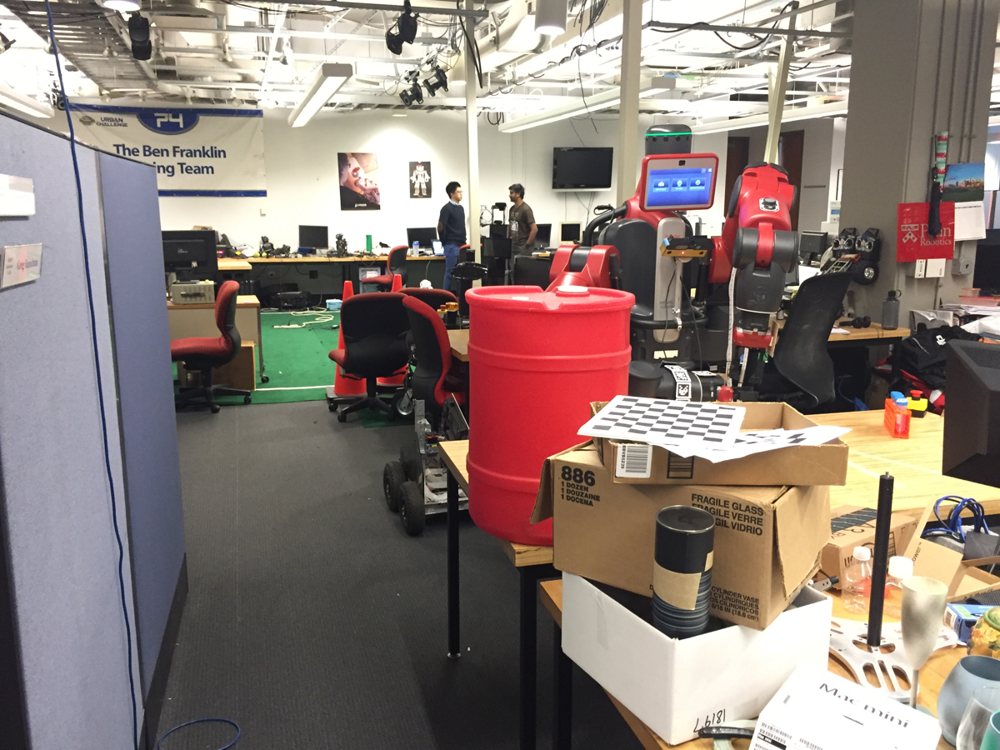
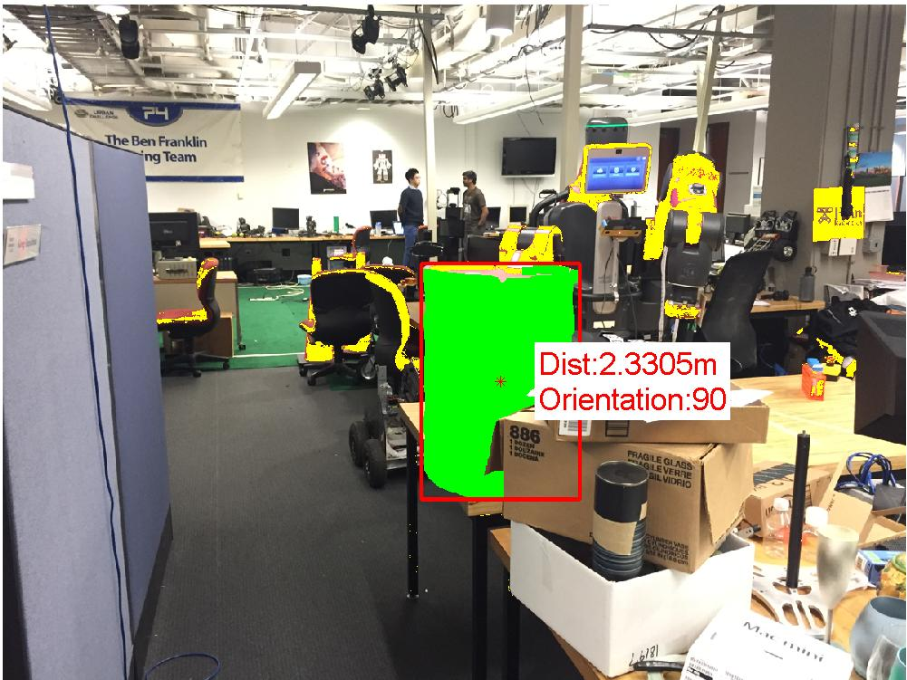
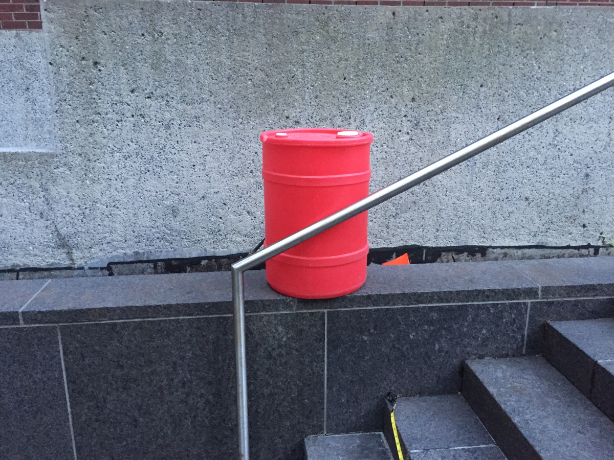
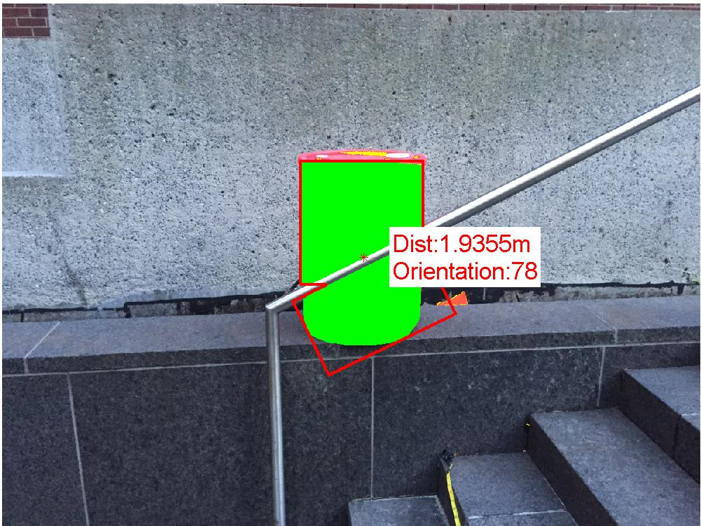
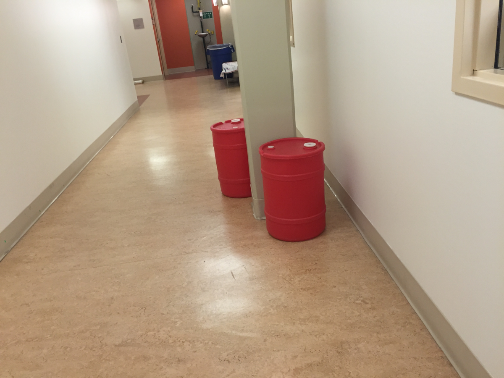
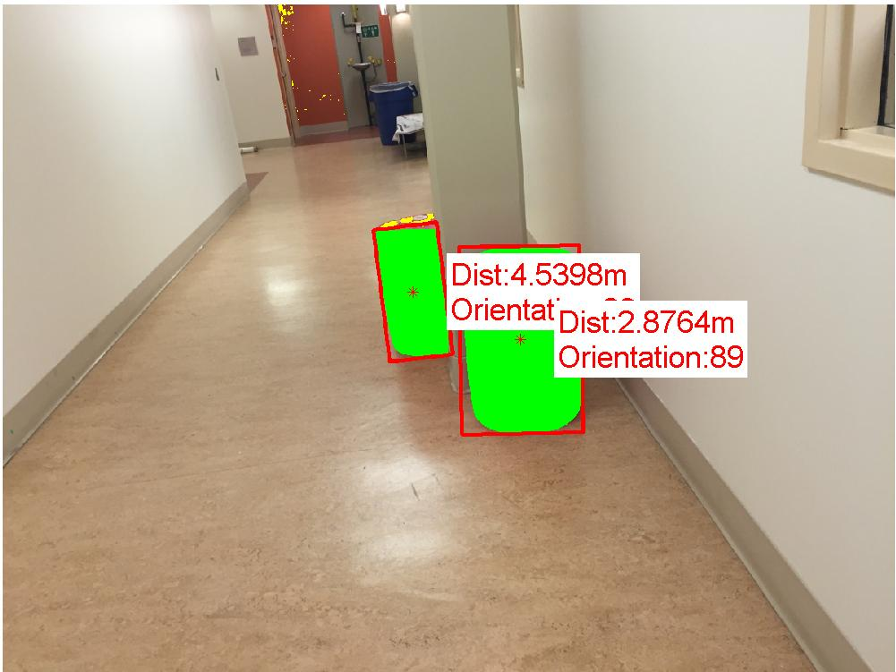
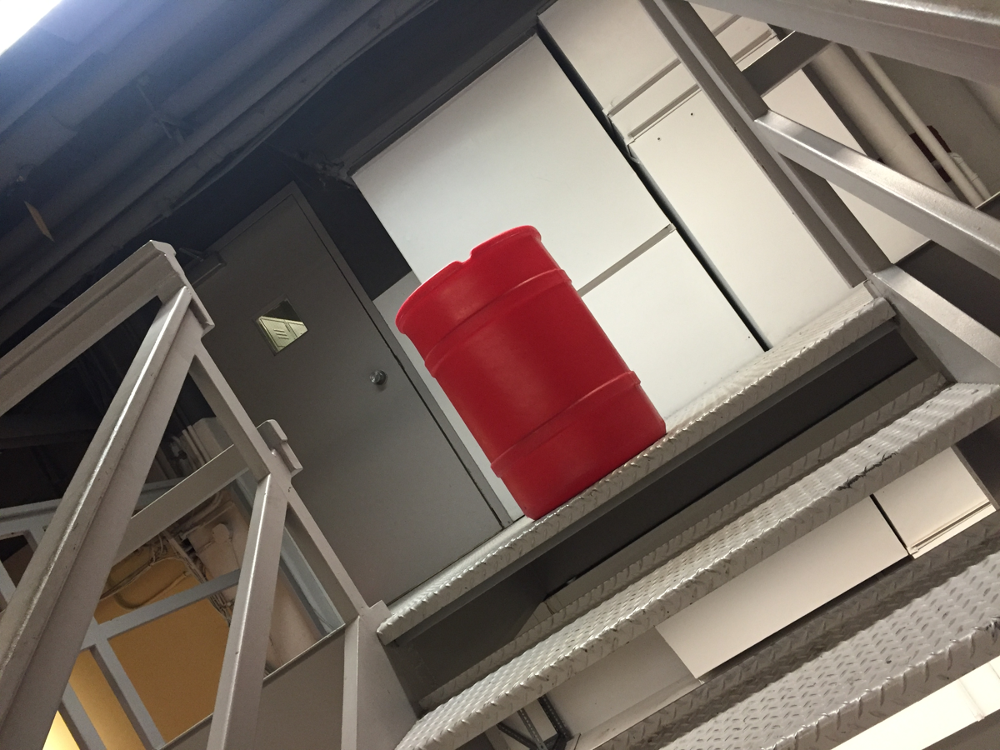
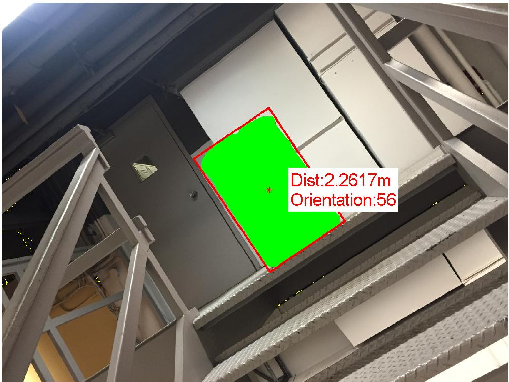

# Colored Barrel Detection Using Gaussian Mixture Model based Color Segmentation

## Problem Statement
Given a set of training images in the folder [Train](Train) with the file names as the distance to the barrel in meters, find the distance to all the barrels in each [Test](Test) image.

## Usage Guide:
1.  Run `Wrapper.m`
2. Change ColorSpace by changing `ColorSpace` variable to any one of `RGB` or `YCbCr` or `yRb`. The code thresholds currently work for YCbCr.
3. To train, Set `TrainFlag = 1`, switched off by default. 
4. If you have any questions or queries feel free to raise an issue.

## Sample Input and Outputs:

## GMM Covariance while being trained:

## Reference Codes:
1. Oriented Bounding Box http://www.mathworks.com/matlabcentral/fileexchange/30402-feret-diameter-and-oriented-box/content/imFeretDiameters/imFeretDiameter.m
2. Ellipsoid Plotting http://www.mathworks.com/matlabcentral/fileexchange/13844-plot-an-ellipse-in--center-form-
3. Entropy rate segmentation http://www.merl.com/publications/docs/TR2011-035.pdf

